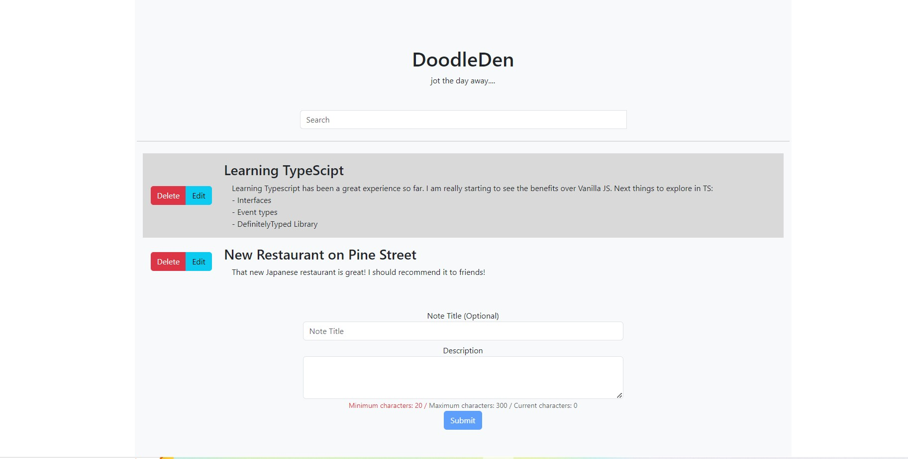

# DoodleDen

Welcome to DoodleDen, the ultimate platform for doodling enthusiasts! Our application allows users to create, share, and explore doodles in a vibrant and interactive community. Whether you're a seasoned artist or just starting out, DoodleDen offers a canvas for your creativity.



## Getting Started

To get started with developing DoodleDen, you'll need to set up your development environment. This guide will walk you through the process of pulling the project from GitHub and setting up both the client-side and the full-stack development environments.

### Prerequisites

Before you begin, ensure you have the following installed on your system:

- Node.js
- npm (Node Package Manager)

### Development Setup

1. **Clone the Repository**

   Start by cloning the DoodleDen repository from GitHub to your local machine.
   Replace `<repository-url>` with the actual URL of the DoodleDen repository.

2. **Client-Side Setup**

To run just the client-side application, follow these steps:

- cd client
- npm install
- npm run dev

This will start the client-side application in development mode.

3. **Full-Stack Setup**

If you prefer to run the full-stack application, you need to set up both the client and the backend services:

- **Client Setup:**

  ```
  cd client
  npm install
  ```

- **Backend Setup:**

  Navigate to the backend directory, which is at the same level as the client directory:

  ```
  cd ../backend
  npm install
  npm start
  ```

  This will start both the client and the backend services, allowing you to run the full-stack application.

### Documentation

This README provides a basic setup guide. For more detailed documentation on development practices, API usage, and other important topics, please refer to the `/docs` directory in the repository. We encourage contributors to familiarize themselves with the documentation to better understand the project structure and contribution guidelines.
